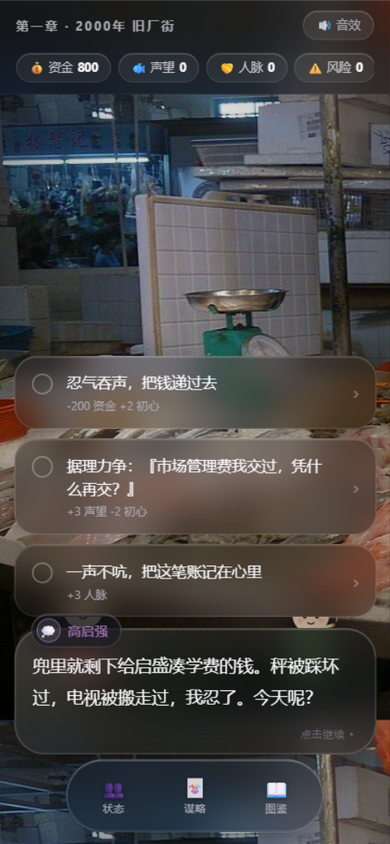

# 🎣 风起旧厂街 · 高启强

> 2000 年，京海市，旧厂街菜市场。你还是一个每天凌晨三点起来进鱼的鱼贩子。
> **四端发布：网页 / Windows / Android APK / Android PWA** · 9 结局 · 13 成就 · Q版立绘 + 写实绘画风场景


## ⬇️ 下载

### 📱 Android APK（推荐）
**[下载 风起旧厂街-v2.4.apk](../../releases/latest)** —— 约 1 MB，传到手机点击安装即玩
> 包名 `com.uahz.fengqi` · 最低 Android 5.0 · 竖屏 · 已签名（debug 证书，可直接安装体验）

### 🖥 Windows 桌面版
**[下载 FengqiJiuchangjie.exe](../../releases/latest)** —— 约 16 MB，免安装双击即玩
> 需 Windows 10/11（系统自带 WebView2）。存档位于 `%APPDATA%\FengqiJiuchangjie`。

### 🌐 在线试玩（无需下载）
- **网页版（吉卜力风格）**：[点击即玩](https://uahz.github.io/fengqi-jiuchangjie/fengqi-jiuchangjie.html)
- **安卓版 PWA（液态玻璃）**：[点击进入](https://uahz.github.io/fengqi-jiuchangjie/mobile/)，安卓 Chrome 菜单「添加到主屏幕」即作为独立 App 安装，支持离线

## 🎨 三套 UI，同一段人生

| 端 | 风格 | 说明 |
|---|---|---|
| 网页 / Windows | **吉卜力风格** | 奶油底 × 鼠尾草绿，云朵漂浮、水彩纹理、圆润卡片、微风感动效 |
| Android APK / PWA | **Luma 暗色 × 液态玻璃** | 近黑底 + 玻璃拟态面板（模糊增饱和 + 高光镜圈）× 底部悬浮玻璃导航 |

**对话演出**：14 位角色手绘 Q 版立绘 + **写实绘画风场景背景**（旧厂街鱼市 / 派出所 / 白金瀚 / 大厦顶层 / 雨夜 / 审讯室 / 晨光屋顶），随地点与对话对象切换淡入，第三视角双人同框。

**图标**：《狂飙》海报风 —— 墨黑底 × 白色书法「狂飙」× 红色笔触飞溅，三端统一。

## 🎮 玩法（V2）

- **对话驱动**：40+ 剧情节点，四个时代（2000 旧厂街 → 2006 风起 → 2015 登顶 → 2021 潮退），打字机台词，点击/空格推进
- **五维属性**：💰资金 🐟声望 🤝人脉 ⚠️风险 ❤️初心；每个选项自带数值预览，部分选项需人脉达标或持有关键印记
- **🌊 风浪回合**：章节之间的经营层——每时代 4 回合（卖鱼/读书/结交/打点/陪家人/拓张），45% 概率降临随机风浪事件（共 18 种）
- **🃏 谋略卡**：研读《孙子兵法》习得六张卡（瞒天过海/借刀杀人/反客为主/金蝉脱壳/以逸待劳/远交近攻），在六个关键剧情打出隐藏选项
- **👥 人物好感**：安欣/启盛/启兰/大嫂/老默/黄瑶六人好感面板，≥70 解锁专属隐藏选项
- **🏆 成就系统**：13 枚成就 · **9 种结局** · S/A/B/C 评级 · 三页图鉴（结局 / 成就 / 谋略）
- **📱 安卓专属**：**长按选项可拖动选择**（Apple 式手感：长按 0.17s 进入拖拽态、触感反馈、拖动高亮、松手即选中）


## 🌊 风浪回合 · 🃏 谋略卡

| 风浪回合 | 谋略卡隐藏选项 |
|---|---|
|  |  |

## 👥 人物好感 · 🏆 成就

| 好感面板 | 成就页 |
|---|---|
|  |  |

## 📱 安卓版

| 标题 | 对话与场景 | 选项卡 |
|---|---|---|
|  |  |  |

更多界面：[结局](_shots/gao-6-ending.png) · [章节过场](_shots/gao-4-era.png) · [结局图鉴](_shots/gao-7-gallery.png) · [白金瀚](_shots/gao-5-ch2.png)

## 🎬 题材说明

基于电视剧《狂飙》前期故事的同人演绎，角色与事件均为艺术再创作；暴力情节全部侧写处理，结局传达「法网恢恢、回头是岸」。

## 🛠️ 技术

- 纯原生 **HTML/CSS/JS 单文件**，零外部依赖、零构建、离线可玩
- **WebAudio** 实时合成全部音效（打字滴答 / 选择确认 / 风险告警 / 过场三连音），可一键静音
- 场景背景为内联 **base64 写实绘画风图像**（浏览器 Canvas 绘画化处理：重采样笔触 + 色彩浓缩 + 暗角）
- **Android APK**：原生 WebView 外壳（`android/`），免 Gradle 构建链（aapt2 → javac → d8 → zipalign → apksigner），DOM Storage 持久化存档
- 图标由 **Canvas 程序化绘制**（黑底 + 书法「狂飙」+ 红笔触），三端共用
- `localStorage` 自动存档（受限上下文安全降级）+ 图鉴 / 成就 / 谋略进度持久化

## ✅ 质量验证

- 内置 `window.__qa(n)` 剧情图自检：静态校验全部节点引用 + n 局随机选择模拟通关（含风浪回合）——实测 **600 局 100% 到达结局、0 错误**
- APK 经 `apksigner verify` 签名校验 + `aapt2 dump badging` 清单校验
- 桌面版 `--selftest` 验证 WebView2 环境引擎加载
- 三端全界面浏览器实测截图（见 `_shots/`）

设计文档见 [fengqi-jiuchangjie-design.md](fengqi-jiuchangjie-design.md)。

## 📁 结构

```
fengqi-jiuchangjie.html        # 网页版（吉卜力风格 + 立绘 + 写实场景，双击即玩）
mobile/                        # 安卓 PWA 版（液态玻璃：index.html + manifest + SW + 图标）
android/                       # 安卓 APK 工程（MainActivity.java + Manifest + res + assets + 构建脚本）
fengqi_jiuchangjie.py          # Windows 桌面版启动器（pywebview 封装）
fengqi.ico                     # 程序图标（狂飙海报风）
fengqi-jiuchangjie-design.md   # 设计文档
_shots/                        # 界面截图
```

## 🛠️ 从源码构建

**Windows 桌面版**
```bash
pip install pywebview pyinstaller
python -m PyInstaller --onefile --windowed --name FengqiJiuchangjie --icon fengqi.ico \
  --add-data "fengqi-jiuchangjie.html;." --collect-all webview fengqi_jiuchangjie.py
```

**Android APK**（需 JDK 17 + Android SDK build-tools 34 / platform 34）
```bash
cd android && build_apk.bat      # aapt2 → javac → d8 → zipalign → apksigner
```

## License

[MIT](LICENSE)
