# 🎣 风起旧厂街 · 高启强

> 2000 年，京海市，旧厂街菜市场。你还是一个每天凌晨三点起来进鱼的鱼贩子。
> **四端发布：网页 / Windows / Android APK / Android PWA** · 9 结局 · 13 成就 · 照片级写实场景

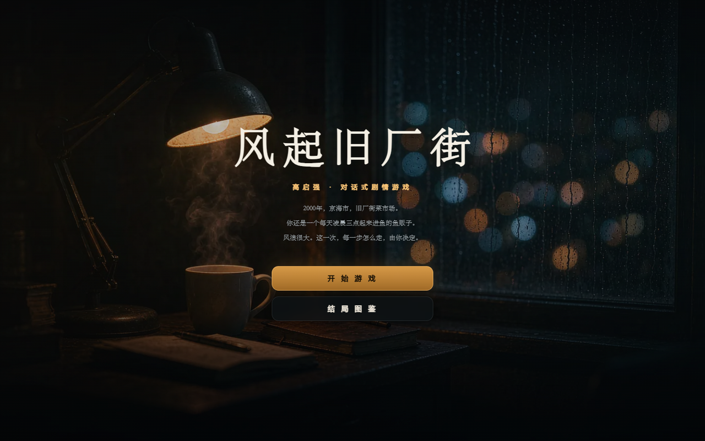

## 🎬 V2.5 · 写实电影感

V2.5 把整套视觉换成**暗夜电影感**：低照度写真背景、暖琥珀实用光与冷青阴影对撞、浅景深、胶片颗粒、湿面反光，配合暗夜玻璃拟态面板与暖金强调色。三端共用同一套视觉语言。

| 对话与抉择 | 雨夜街道 |
|---|---|
| 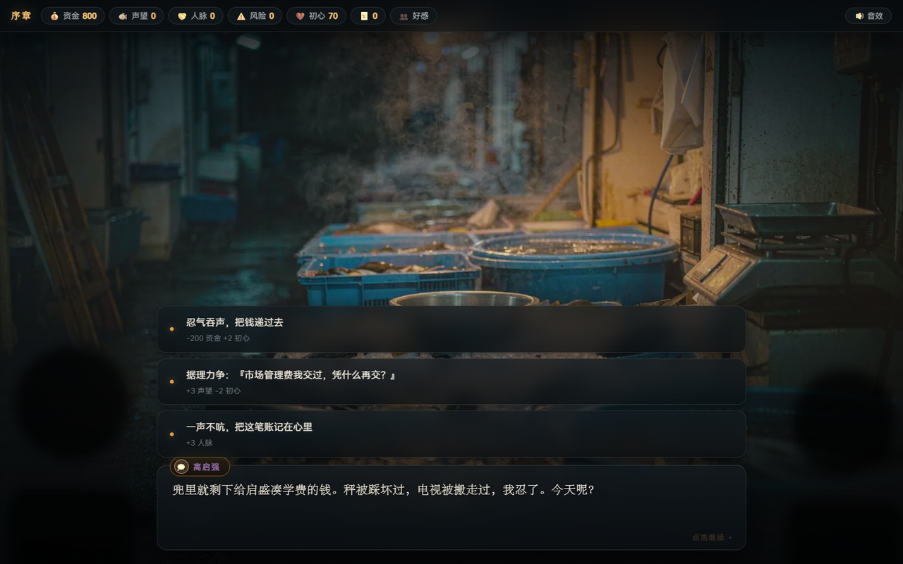 | 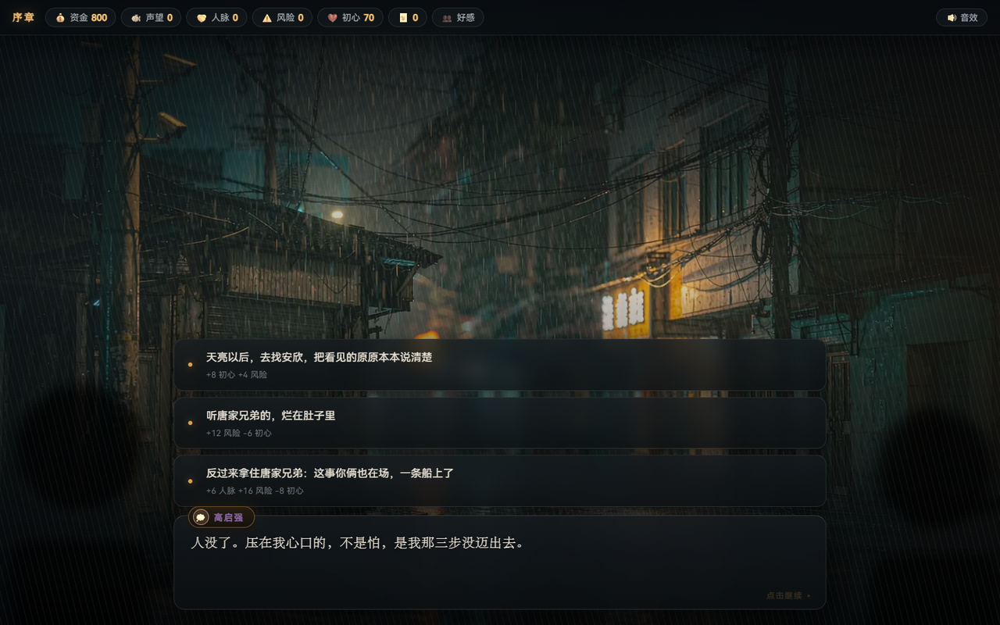 |

## ⬇️ 下载

### 📱 Android APK（推荐）
**[下载 fengqi-jiuchangjie-v2.5.apk](../../releases/latest)** —— **约 0.8 MB**，传到手机点击安装即玩
> 包名 `com.uahz.fengqi` · 最低 Android 5.0 · 竖屏 · 已签名（debug 证书，与 v2.4 同签名，可覆盖安装）

### 🖥 Windows 桌面版
**[下载 FengqiJiuchangjie.exe](../../releases/latest)** —— 约 15 MB，免安装双击即玩
> 需 Windows 10/11（系统自带 WebView2）。存档位于 `%APPDATA%\FengqiJiuchangjie`。

### 🌐 在线试玩（无需下载）
- **网页版（写实电影感）**：[点击即玩](https://uahz.github.io/fengqi-jiuchangjie/fengqi-jiuchangjie.html)
- **安卓版 PWA**：[点击进入](https://uahz.github.io/fengqi-jiuchangjie/mobile/)，安卓 Chrome 菜单「添加到主屏幕」即作为独立 App 安装，支持离线

## 🎨 七个写实场景

| 旧厂街鱼市（开篇） | 白金瀚夜总会 | 风浪回合 |
|---|---|---|
|  | 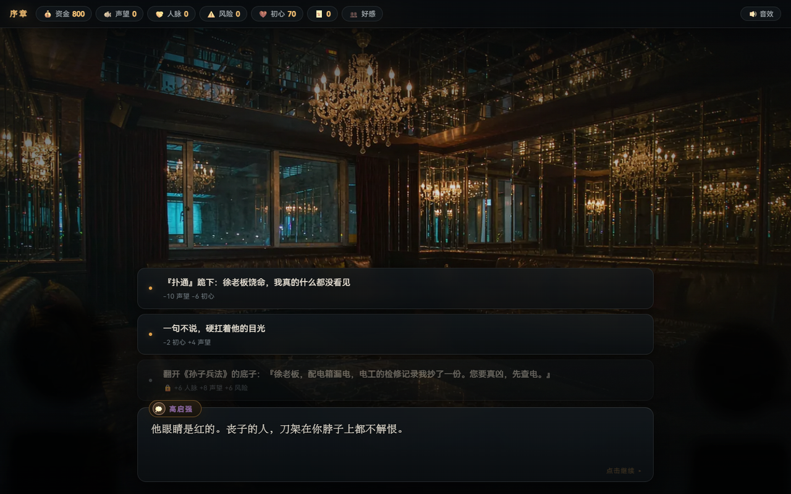 | 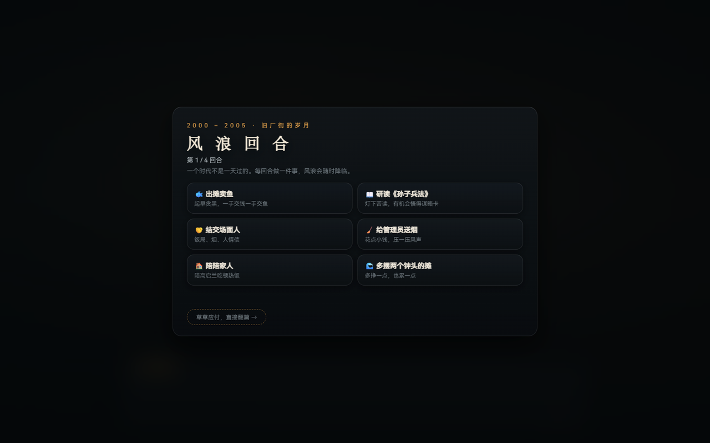 |

| 时代过场 | 结局图鉴 | 人物好感 | 结局 |
|---|---|---|---|
| 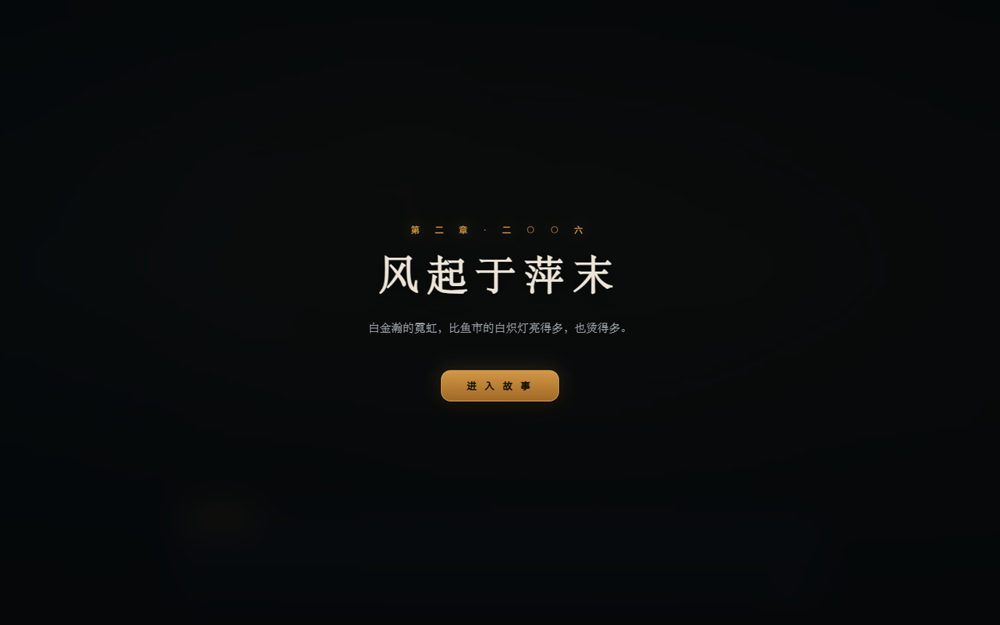 | 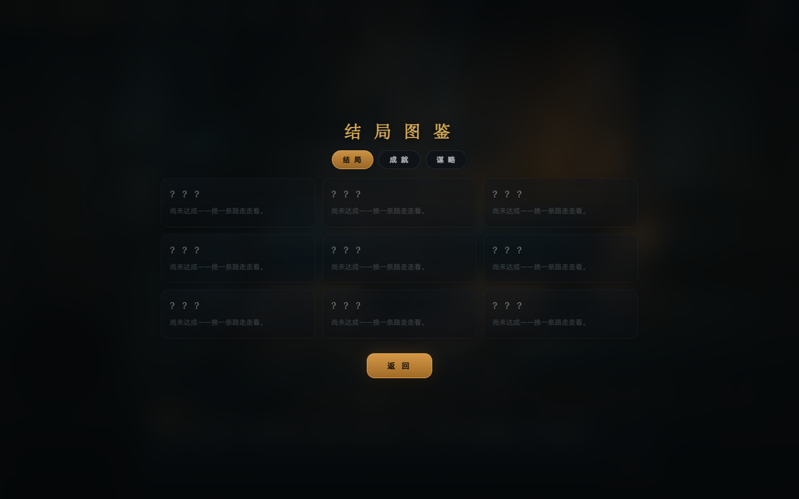 | 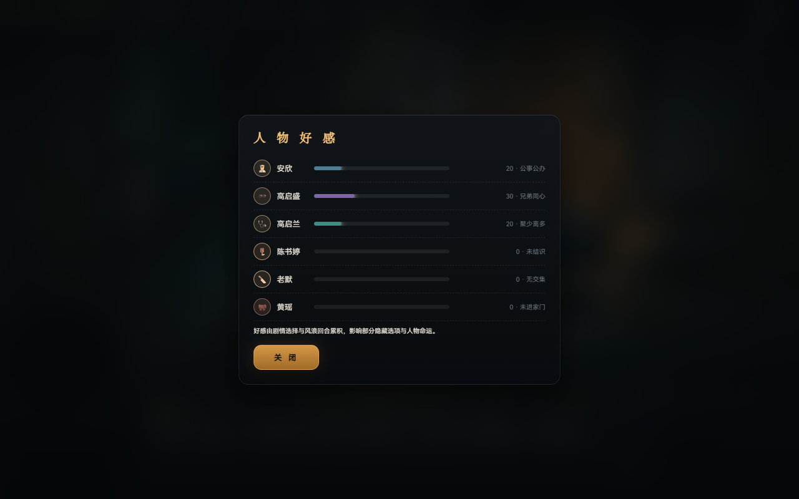 | 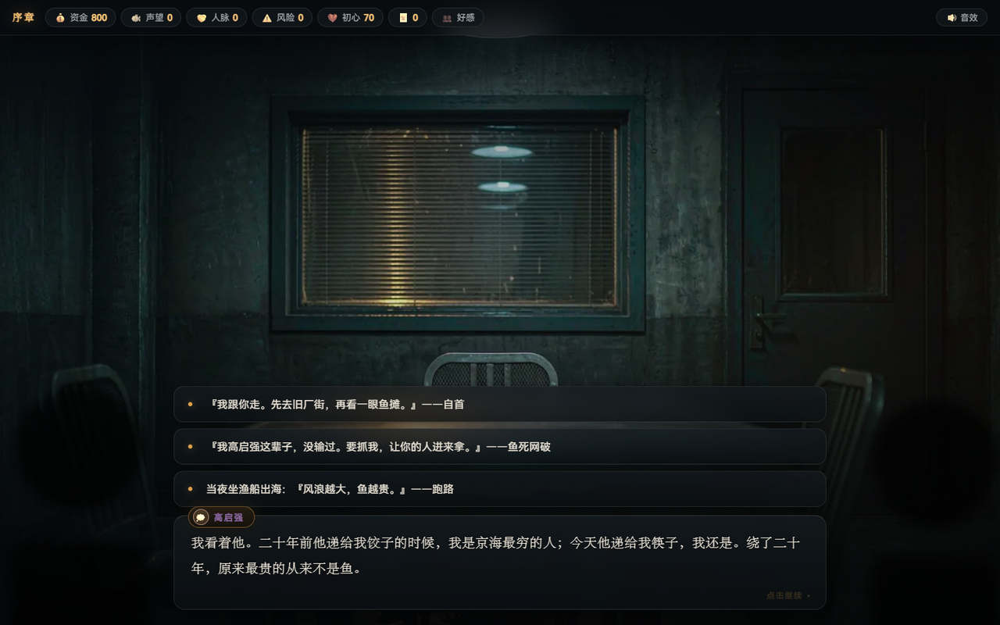 |

**场景**：旧厂街鱼市 / 派出所走廊 / 白金瀚 / 大厦顶层 / 雨夜街道 / 审讯室 / 晨光天台 —— 7 张照片级背景，随地点切换淡入，并叠加胶片颗粒、暗角与电影调色。

**图标**：暗底暖金鲤鱼（旧厂街鱼摊意象），三端统一；小到 32px 仍清晰可辨。

## 🎮 玩法（V2）

- **对话驱动**：40+ 剧情节点，四个时代（2000 旧厂街 → 2006 风起 → 2015 登顶 → 2021 潮退），打字机台词，点击/空格推进
- **五维属性**：💰资金 🐟声望 🤝人脉 ⚠️风险 ❤️初心；每个选项自带数值预览，部分选项需人脉达标或持有关键印记
- **🌊 风浪回合**：章节之间的经营层——每时代 4 回合（卖鱼/读书/结交/打点/陪家人/拓张），45% 概率降临随机风浪事件（共 18 种）
- **🃏 谋略卡**：研读《孙子兵法》习得六张卡（瞒天过海/借刀杀人/反客为主/金蝉脱壳/以逸待劳/远交近攻），在六个关键剧情打出隐藏选项
- **👥 人物好感**：安欣/启盛/启兰/大嫂/老默/黄瑶六人好感面板，≥70 解锁专属隐藏选项
- **🏆 成就系统**：13 枚成就 · **9 种结局** · S/A/B/C 评级 · 三页图鉴（结局 / 成就 / 谋略）
- **📱 全平台长按拖拽**：长按选项约 0.17 秒进入拖拽选择（Apple 式手感：拖动时目标项高亮、触感反馈、松手即选中）——三端通用

## 📱 安卓专属优化

| 长按拖拽选择 | 人物好感 | 时代过场 |
|---|---|---|
| 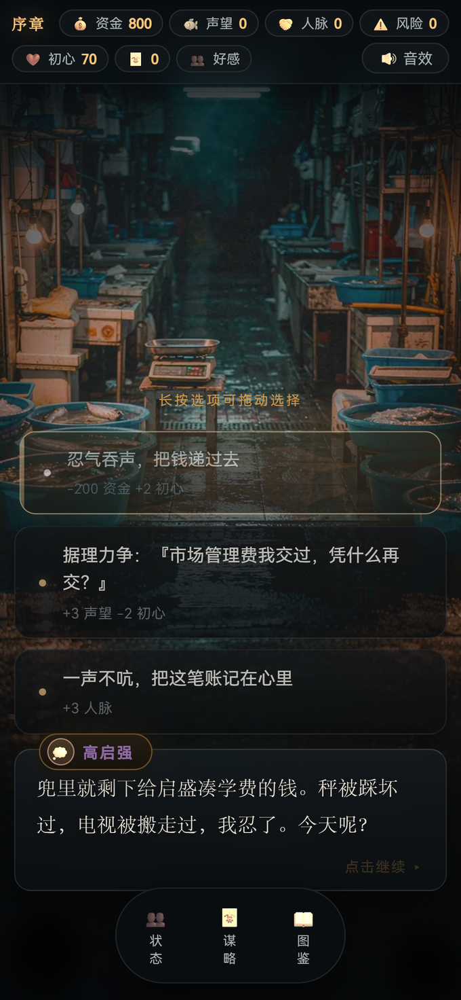 | 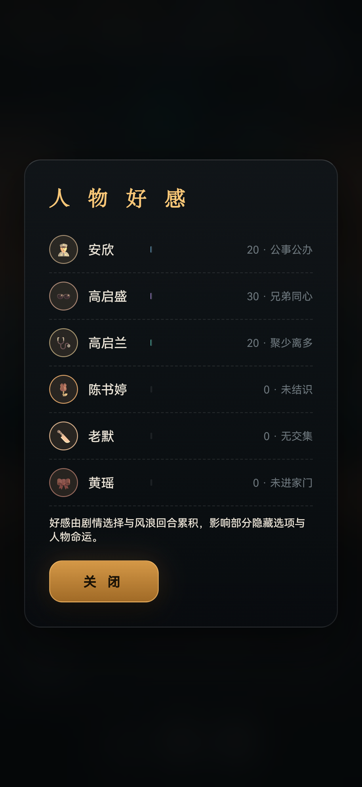 | 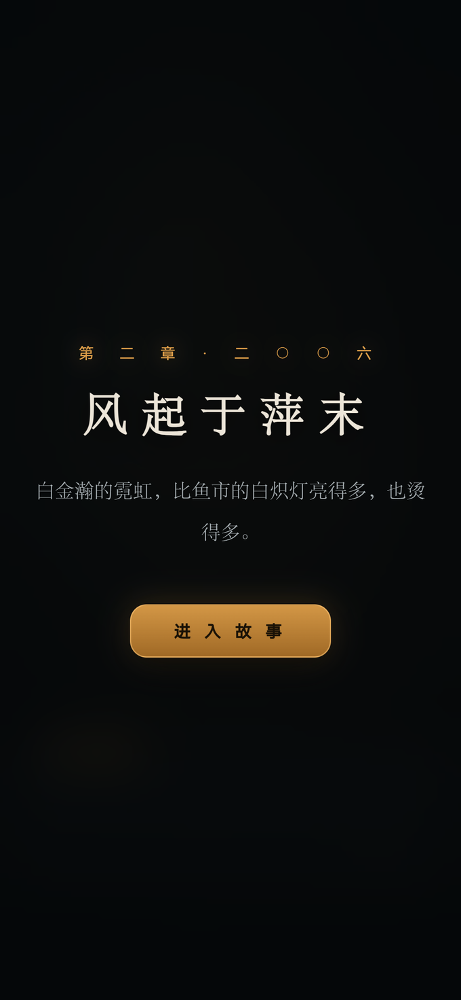 |

- **底部悬浮导航**：状态 / 谋略 / 图鉴，手机拇指可达
- **关闭系统强制暗色**（`setAlgorithmicDarkeningAllowed(false)` / `FORCE_DARK_OFF`）——否则 Android 10+ 会自动反色页面，把写实照片的调色毁掉
- **背景改为独立 WebP 文件**按需加载，页面体积 1020 KB → 121 KB；APK 1065 KB → 813 KB
- **开启 `setOffscreenPreRaster`** 预栅格化，滑动更稳
- **弱机自动低特效档**：`navigator.hardwareConcurrency ≤ 4` 时关闭毛玻璃 / 颗粒动画 / Ken Burns 位移
- **安全区适配**：原生层把状态栏 / 导航条高度注入 CSS 变量 `--sat` / `--sab`，顶栏不被刘海遮挡

## 🎬 题材说明

基于电视剧《狂飙》前期故事的同人演绎，角色与事件均为艺术再创作；暴力情节全部侧写处理，结局传达「法网恢恢、回头是岸」。

## 🛠️ 技术

- 纯原生 **HTML/CSS/JS 单文件**（网页版），零外部依赖、零构建、离线可玩
- **WebAudio** 实时合成全部音效（打字滴答 / 选择确认 / 风险告警 / 过场三连音），可一键静音
- **写实背景**为 WebP（质量 78），7 场景 × 2 构图；颗粒层用 `transform` 动画走合成层，不触发重绘
- **Android APK**：原生 WebView 外壳（`android/`），免 Gradle 构建链（aapt2 → javac → d8 → zipalign → apksigner），DOM Storage 持久化存档
- **Windows 桌面版**：pywebview + PyInstaller onefile；页面经本地 HTTP 服务承载以保证 `localStorage` 可用（`about:blank` 下存档会失效）
- `localStorage` 自动存档（受限上下文安全降级）+ 图鉴 / 成就 / 谋略进度持久化

## ✅ 质量验证

- 内置 `window.__qa(n)` 剧情图自检：静态校验全部节点引用 + n 局随机选择模拟通关（含风浪回合）
- **实测 600 局 × 3 端（网页 / PWA / APK 资源）100% 到达结局、0 错误**
- **长按拖拽 7 项真机模拟测试全通过**（Playwright 驱动 Edge，iPhone 视口 390×844）
- APK 经 `apksigner verify` 校验（v1+v2+v3 签名方案全部通过）+ `aapt2 dump badging` 清单校验
- 桌面版 `--selftest` 验证引擎加载与 localStorage 可用性
- 覆盖 1440 / 1920 宽桌面与 390 / 412 / 360 小屏的视口核对

设计文档见 [fengqi-jiuchangjie-design.md](fengqi-jiuchangjie-design.md)。

## 📁 结构

```
fengqi-jiuchangjie.html         # 网页版（单文件，背景 base64 内联，横版 1440w）
mobile/                         # PWA：index.html + manifest + SW + img/*.webp（竖版 880w）
android/                        # APK 工程：MainActivity.java + Manifest + res + assets
_shots/                         # 三端界面截图 16 张
_build/                         # 构建脚本（见下）
_art/out/                       # 构建素材：背景 WebP + 各档图标
fengqi_jiuchangjie.py           # 桌面版启动器
FengqiJiuchangjie.spec          # PyInstaller 配置
fengqi-jiuchangjie-design.md    # 设计文档
fengqi.ico                      # 程序图标
```

## 🛠️ 从源码构建

三端由**同一份母版**产出：`_build/theme.css`（唯一样式来源）+ 原游戏逻辑，
经 `_build/build.py` 生成网页版（背景内联）与 PWA / APK（背景外链）两种形态。

```bash
python _build/build.py            # 产出网页版 / PWA / APK 资源三份页面

pip install pywebview pyinstaller
python _build/build_desktop.py    # Windows EXE（自动在 ASCII 临时目录打包并 --selftest）

python _build/build_apk.py        # Android APK（需 JDK 17 + Android SDK build-tools 34 / platform 34）

python _build/package.py          # 打发布 zip
```

验证脚本：

```bash
node _build/test_qa.js 600        # 剧情自检：三端各跑 600 局
node _build/test_drag.js          # 长按拖拽 7 项交互断言
node _build/shots_pw.js all       # 多视口截图
```
（`test_*.js` / `shots_pw.js` 需 `NODE_PATH` 指向装有 `playwright-core` 的 node_modules）

> 注：`aapt2` / `apksigner` 不支持非 ASCII 路径，构建脚本会自动把工程暂存到纯英文临时目录再打包。
> `_build/base/fengqi-jiuchangjie.html` 是承载游戏逻辑的**替换母版**（v2.4 原版），请勿直接修改。

## License

[MIT](LICENSE)
