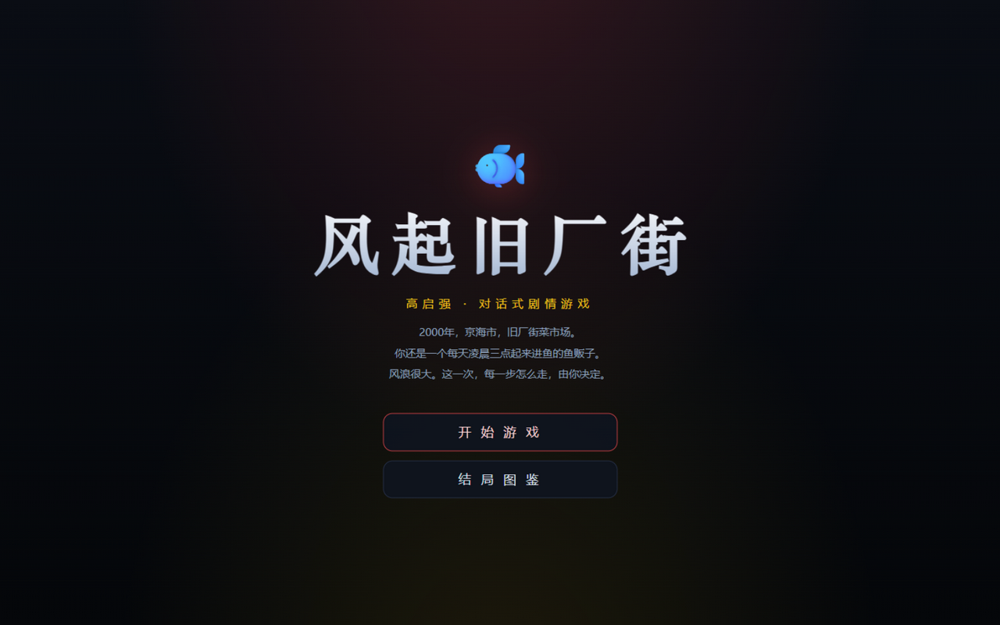
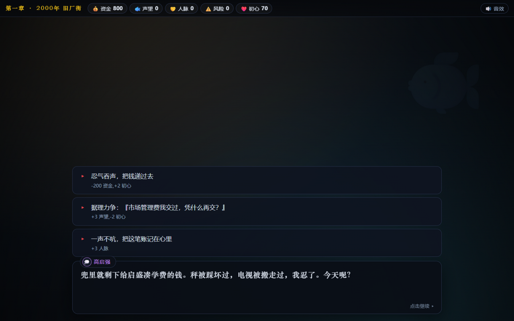
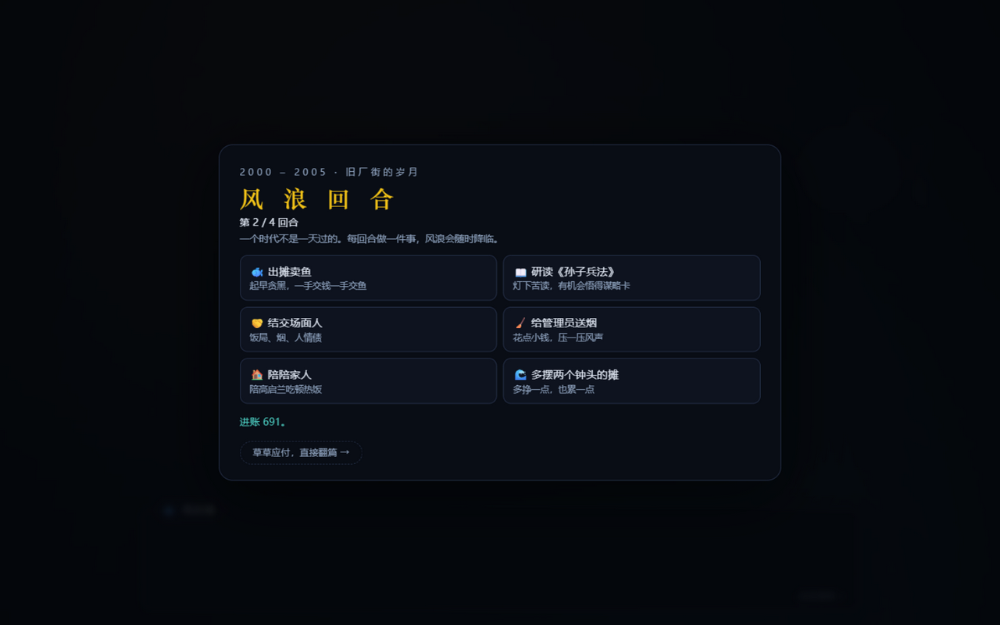
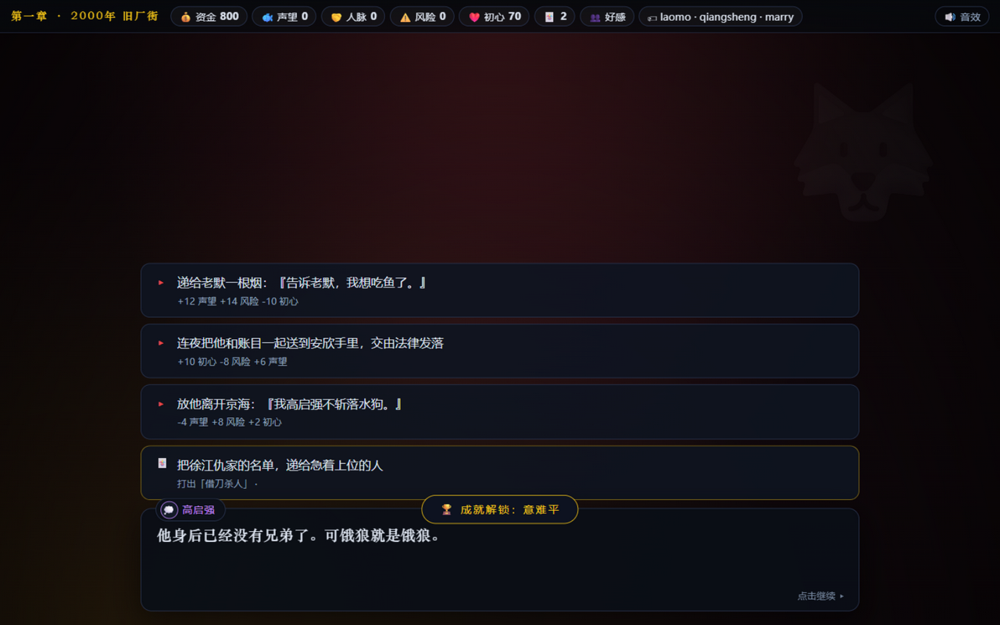
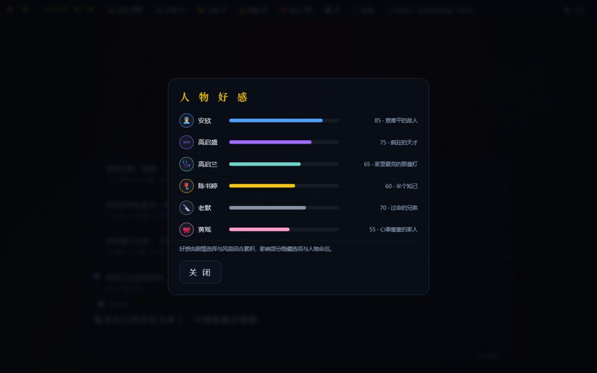
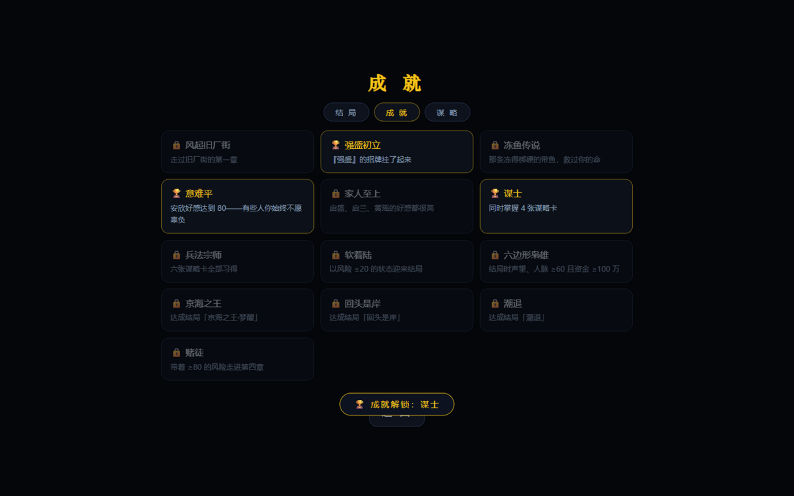

# 🎣 风起旧厂街 · 高启强

> 2000 年，京海市，旧厂街菜市场。你还是一个每天凌晨三点起来进鱼的鱼贩子。
> 单文件 HTML · 零依赖 · 双击即玩 · 9 结局 · 13 成就



## 🌐 在线试玩

**[点击即玩（GitHub Pages）](https://uahz.github.io/fengqi-jiuchangjie/fengqi-jiuchangjie.html)**（首次部署后约 1 分钟生效）

也可以直接下载仓库中的 `fengqi-jiuchangjie.html`，双击即可游玩——零外部依赖，离线可玩。

## 🎮 玩法（V2）

- **对话驱动**：40+ 剧情节点，四个时代（2000 旧厂街 → 2006 风起 → 2015 登顶 → 2021 潮退），打字机台词，点击/空格推进
- **五维属性**：💰资金 🐟声望 🤝人脉 ⚠️风险 ❤️初心；每个选项自带数值效果预览，部分选项需人脉达标或持有关键印记才能解锁
- **🌊 风浪回合**：章节之间的经营层——每时代 4 回合（卖鱼/读书/结交/打点/陪家人/拓张），45% 概率降临随机风浪事件（三个时代共 18 种）
- **🃏 谋略卡**：研读《孙子兵法》习得六张卡（瞒天过海/借刀杀人/反客为主/金蝉脱壳/以逸待劳/远交近攻），在六个关键剧情打出金色隐藏选项
- **👥 人物好感**：安欣/启盛/启兰/大嫂/老默/黄瑶六人好感面板，≥70 解锁专属隐藏选项，安欣好感 ≥75 亦通向"回头是岸"
- **🏆 成就系统**：13 枚成就（意难平、冻鱼传说、兵法宗师、六边形枭雄……），解锁即时 toast，图鉴成就页总览，结局页附"本次成就"
- **27 枚印记**：《孙子兵法》、安欣的名片、老默的忠心、保护伞、良知未泯……终局结算页完整回顾你走过的路
- **9 种结局**：潮退 / 京海之王·梦醒 / 回头是岸 / 灰烬 / 鱼死网破 / 亡命南洋 + 3 条章末风险检定败亡线；结局页附「人物命运」名单
- **S/A/B/C 评级 + 三页图鉴**（结局/成就/谋略）：localStorage 自动存档与进度持久化，多周目收集



## 🌊 风浪回合 · 🃏 谋略卡

| 风浪回合 | 谋略卡隐藏选项 |
|---|---|
|  |  |

## 👥 人物好感 · 🏆 成就

| 好感面板 | 成就页 |
|---|---|
|  |  |

更多界面：[结局](_shots/gao-6-ending.png) · [章节过场](_shots/gao-4-era.png) · [结局图鉴](_shots/gao-7-gallery.png) · [2006 白金瀚](_shots/gao-5-ch2.png) · [第一章鱼市](_shots/gao-2-ch1.png)

## 🎬 题材说明

基于电视剧《狂飙》前期故事的同人演绎，角色与事件均为艺术再创作；暴力情节全部侧写处理，结局传达「法网恢恢、回头是岸」。

## 🛠️ 技术

- 纯原生 **HTML/CSS/JS 单文件**，零外部依赖、零构建、离线可玩
- **WebAudio** 实时合成全部音效（打字滴答 / 选择确认 / 风险告警 / 过场三连音），可一键静音
- 场景背景为 CSS 渐变分层（鱼市晨雾 / 白金瀚红金 / 雨夜 / 铁栏），`prefers-reduced-motion` 全量降级
- `localStorage` 自动存档、结局图鉴 / 成就 / 印记持久化

## ✅ 质量验证

- 页面内置 `window.__qa(n)` 剧情图自检：静态遍历全部节点校验引用完整性，再模拟 n 局随机选择通关（含风浪回合随机经营）——实测 **600 局随机通关 100% 到达结局、0 错误**
- 全界面浏览器实测截图验收（见 `_shots/`）

设计文档见 [fengqi-jiuchangjie-design.md](fengqi-jiuchangjie-design.md)。

## 📁 结构

```
fengqi-jiuchangjie.html        # 游戏本体（单文件，双击即玩）
fengqi-jiuchangjie-design.md   # 设计文档（循环 / 数值 / 章节 / 结局 / V2 系统）
_shots/                        # 界面截图
```

## License

[MIT](LICENSE)
