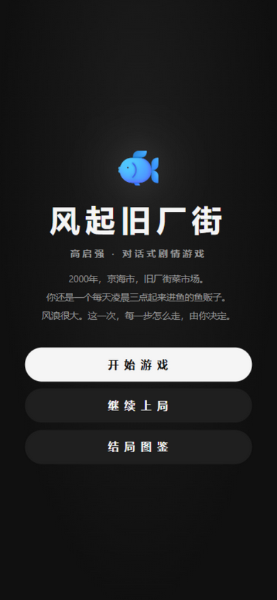
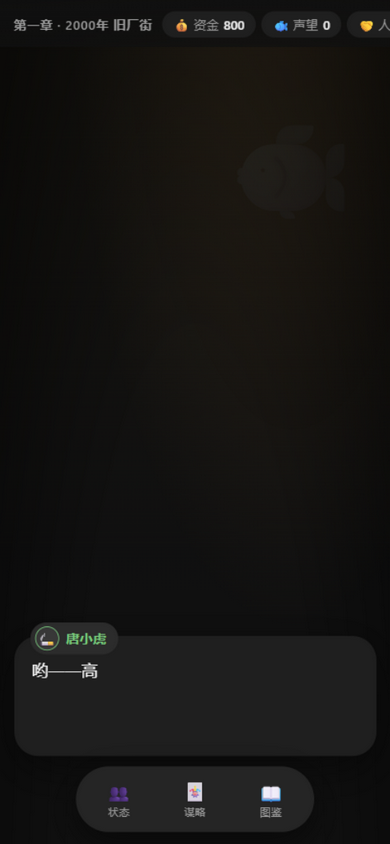
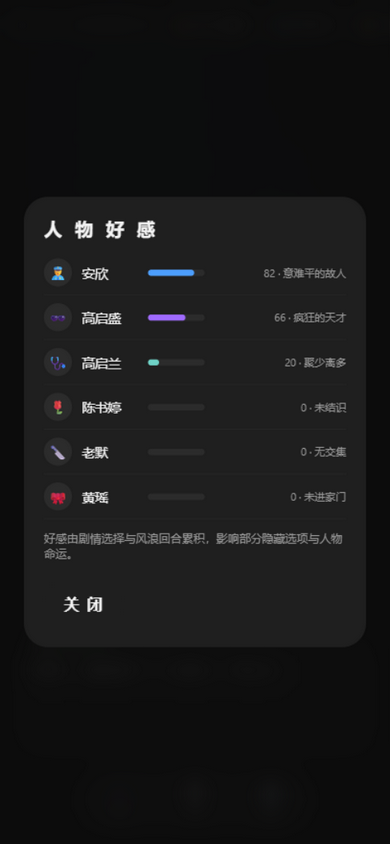

# 🎣 风起旧厂街 · 高启强

> 2000 年，京海市，旧厂街菜市场。你还是一个每天凌晨三点起来进鱼的鱼贩子。
> 网页 · Windows · Android（PWA）三端 · 9 结局 · 13 成就


## 🌐 在线试玩

- **网页版（吉卜力风格）**：[点击即玩（GitHub Pages）](https://uahz.github.io/fengqi-jiuchangjie/fengqi-jiuchangjie.html)
- **安卓版（Luma 深色风格 · PWA）**：[点击进入](https://uahz.github.io/fengqi-jiuchangjie/mobile/)，在安卓 Chrome 菜单中选择「添加到主屏幕」即可作为独立 App 全屏安装，支持离线游玩

也可以直接下载仓库中的对应 HTML 文件双击游玩——零外部依赖，离线可玩。

## ⬇️ 下载桌面版

前往 [Releases](../../releases) 下载 `FengqiJiuchangjie.exe`（约 16 MB，免安装，双击即玩）。

> 需 Windows 10/11（系统自带 WebView2 运行时）。自动存档位于 `%APPDATA%\FengqiJiuchangjie`。杀毒软件若对 PyInstaller 单文件报警，请添加信任。

## 🎨 双风格设计

| 端 | 风格 | 说明 |
|---|---|---|
| 网页 / Windows | **吉卜力风格** | 奶油底 × 鼠尾草绿，云朵漂浮、水彩纹理、圆润卡片、微风感动效 |
| Android（PWA） | **Luma 暗色** | 近黑底 × 大圆角卡片 × 白色胶囊主按钮 × 底部悬浮玻璃导航，票据式单选卡片 |

## 🎮 玩法（V2）

- **对话驱动**：40+ 剧情节点，四个时代（2000 旧厂街 → 2006 风起 → 2015 登顶 → 2021 潮退），打字机台词，点击/空格推进
- **五维属性**：💰资金 🐟声望 🤝人脉 ⚠️风险 ❤️初心；每个选项自带数值效果预览，部分选项需人脉达标或持有关键印记才能解锁
- **🌊 风浪回合**：章节之间的经营层——每时代 4 回合（卖鱼/读书/结交/打点/陪家人/拓张），45% 概率降临随机风浪事件（三个时代共 18 种）
- **🃏 谋略卡**：研读《孙子兵法》习得六张卡（瞒天过海/借刀杀人/反客为主/金蝉脱壳/以逸待劳/远交近攻），在六个关键剧情打出隐藏选项
- **👥 人物好感**：安欣/启盛/启兰/大嫂/老默/黄瑶六人好感面板，≥70 解锁专属隐藏选项，安欣好感 ≥75 亦通向"回头是岸"
- **🏆 成就系统**：13 枚成就（意难平、冻鱼传说、兵法宗师、六边形枭雄……），解锁即时 toast，图鉴成就页总览，结局页附"本次成就"
- **27 枚印记**：《孙子兵法》、安欣的名片、老默的忠心、保护伞、良知未泯……终局结算页完整回顾你走过的路
- **9 种结局**：潮退 / 京海之王·梦醒 / 回头是岸 / 灰烬 / 鱼死网破 / 亡命南洋 + 3 条章末风险检定败亡线；结局页附「人物命运」名单
- **S/A/B/C 评级 + 三页图鉴**（结局/成就/谋略）：localStorage 自动存档与进度持久化，多周目收集


## 🌊 风浪回合 · 🃏 谋略卡

| 风浪回合 | 谋略卡隐藏选项 |
|---|---|
|  |  |

## 👥 人物好感 · 🏆 成就

| 好感面板 | 成就页 |
|---|---|
|  |  |

## 📱 安卓版（PWA）

| 标题 | 对话与抉择 | 状态面板 |
|---|---|---|
|  |  |  |

- 手机浏览器打开 [mobile 页面](https://uahz.github.io/fengqi-jiuchangjie/mobile/) → 菜单「添加到主屏幕」→ 以独立 App 全屏运行
- Service Worker 缓存全部资源，**首次打开后离线可玩**；存档与成就本地持久化

更多网页版界面：[结局](_shots/gao-6-ending.png) · [章节过场](_shots/gao-4-era.png) · [结局图鉴](_shots/gao-7-gallery.png) · [2006 白金瀚](_shots/gao-5-ch2.png) · [第一章鱼市](_shots/gao-2-ch1.png)

## 🎬 题材说明

基于电视剧《狂飙》前期故事的同人演绎，角色与事件均为艺术再创作；暴力情节全部侧写处理，结局传达「法网恢恢、回头是岸」。

## 🛠️ 技术

- 纯原生 **HTML/CSS/JS 单文件**，零外部依赖、零构建、离线可玩
- **WebAudio** 实时合成全部音效（打字滴答 / 选择确认 / 风险告警 / 过场三连音），可一键静音
- 网页端：吉卜力风格 CSS 渐变天空 + 云朵漂浮 + 水彩纹理；`prefers-reduced-motion` 全量降级
- 安卓端：Luma 风格移动布局 + `manifest.json` + Service Worker（cache-first 离线）
- `localStorage` 自动存档、结局图鉴 / 成就 / 印记持久化（受限上下文安全降级）
- **Windows 桌面版**：`fengqi_jiuchangjie.py` 用 pywebview 封装（WebView2 内核），存档持久化到 `%APPDATA%`

## ✅ 质量验证

- 页面内置 `window.__qa(n)` 剧情图自检：静态遍历全部节点校验引用完整性，再模拟 n 局随机选择通关（含风浪回合随机经营）——实测 **600 局随机通关 100% 到达结局、0 错误**
- 桌面版启动器内置 `--selftest`：验证 WebView2 环境下游戏引擎完整加载
- 全界面浏览器实测截图验收（见 `_shots/`，网页 / 安卓双端）

设计文档见 [fengqi-jiuchangjie-design.md](fengqi-jiuchangjie-design.md)。

## 📁 结构

```
fengqi-jiuchangjie.html        # 网页版游戏本体（吉卜力风格，双击即玩）
fengqi-jiuchangjie-design.md   # 设计文档（循环 / 数值 / 章节 / 结局 / 双端 UI）
fengqi_jiuchangjie.py          # Windows 桌面版启动器（pywebview 封装）
mobile/                        # 安卓版（Luma 风格 PWA：index.html + manifest + SW + 图标）
_shots/                        # 界面截图（gao-* 网页版，gao-a-* 安卓版）
```

## 🛠️ 从源码构建桌面版

```bash
pip install pywebview pyinstaller
python -m PyInstaller --onefile --windowed --name FengqiJiuchangjie --icon icon.ico --add-data "fengqi-jiuchangjie.html;." --collect-all webview fengqi_jiuchangjie.py
```

## License

[MIT](LICENSE)
